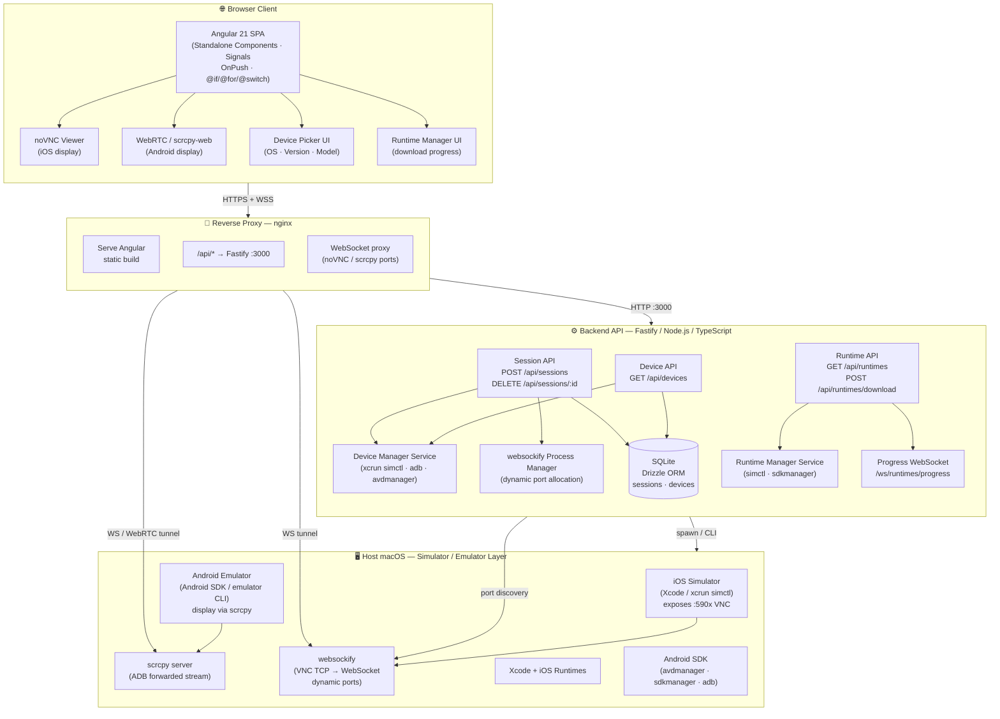
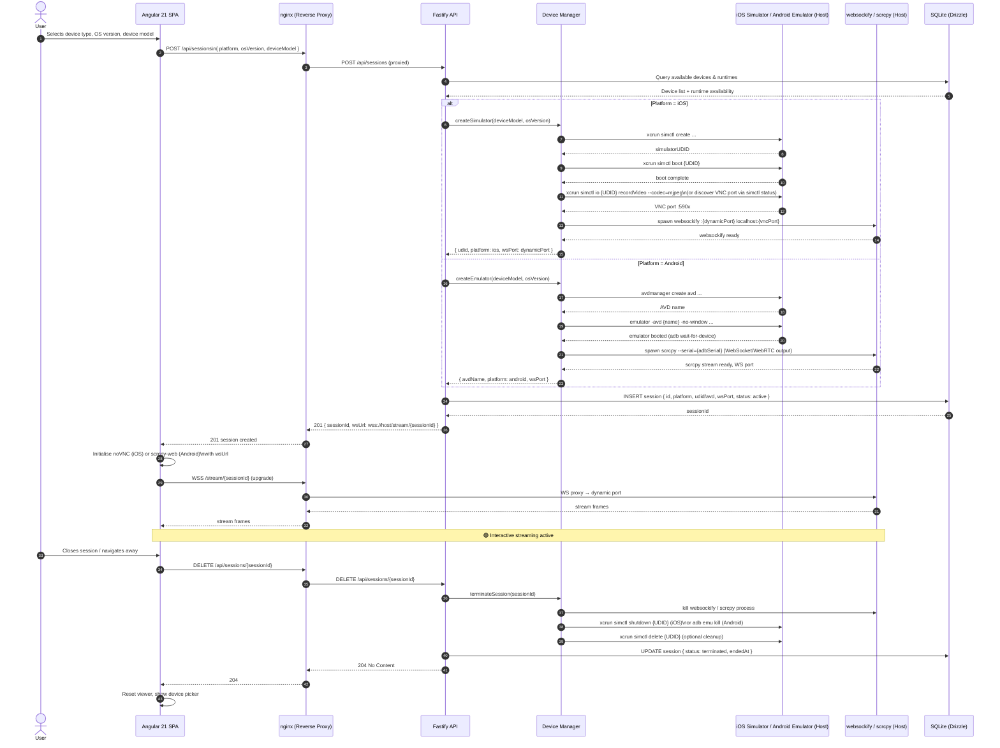
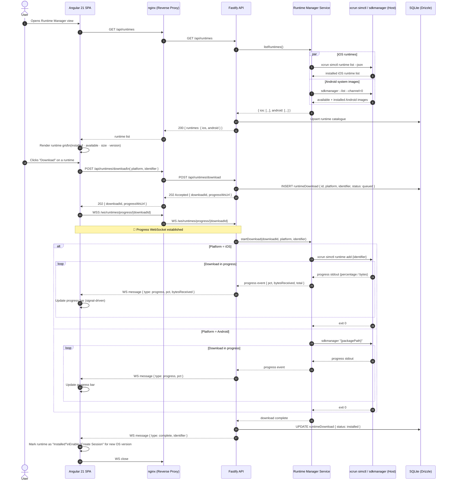
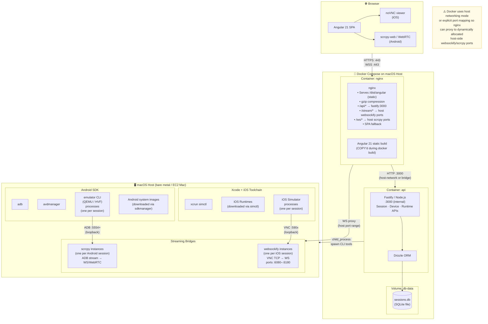
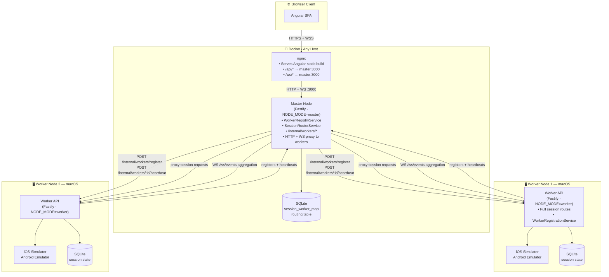

# web-mobile-simulator — Architecture Documentation

> **Status**: Active — Standalone and Distributed modes implemented  
> **Date**: 2026-04-17  
> **Stack**: Angular 21 · Fastify · noVNC · websockify · scrcpy · SQLite (Drizzle ORM) · Docker · nginx · pnpm workspaces

---

## Table of Contents

1. [System Overview](#1-system-overview)
2. [Component Table](#2-component-table)
3. [Data Flow: Start Simulator Session](#3-data-flow-start-simulator-session)
4. [Data Flow: OS Version Management](#4-data-flow-os-version-management)
5. [Container Architecture](#5-container-architecture)
6. [Key Architectural Decisions](#6-key-architectural-decisions)
7. [Distributed Master/Worker Architecture](#7-distributed-masterworker-architecture)

---

## 1. System Overview

The platform streams live iOS Simulator and Android Emulator displays to any web browser. It is designed for self-hosted deployment on physical Mac hardware or AWS EC2 Mac instances. Simulators and emulators run directly on the host macOS OS (they require native hardware); all supporting services are containerised.



### Component Boundaries at a Glance

| Layer | Runs In | Communicates Via |
|---|---|---|
| Angular 21 SPA | Browser | HTTPS REST + WSS |
| nginx | Docker container | TCP/Unix socket to Fastify; WS tunnel to host |
| Fastify API | Docker container | Host networking / bind-mount socket to macOS host |
| iOS Simulator | Host macOS | VNC on loopback `:590x` |
| websockify | Host macOS | Bridges VNC TCP → WS |
| Android Emulator | Host macOS | scrcpy ADB stream |
| SQLite | Docker container (volume) | Drizzle ORM from Fastify |

---

## 2. Component Table

| Component | Technology | Role | Port(s) |
|---|---|---|---|
| **Angular SPA** | Angular 21.2.x · TypeScript · standalone components · signals · OnPush | Interactive device picker, noVNC viewer, runtime management UI, WebSocket progress display | N/A (browser-side) |
| **nginx** | nginx (Alpine) | Reverse proxy; serves Angular static build; gzip compression; routes `/api/*` to Fastify; proxies WebSocket connections for VNC and scrcpy streams; SPA fallback | `80`, `8080` |
| **Fastify API** | Fastify · Node.js · TypeScript | REST API for session lifecycle, device inventory, runtime management; manages simulator/emulator processes; allocates websockify ports | `3000` (internal) |
| **Device Manager** | `xcrun simctl` · `adb` · `avdmanager` (Node.js child_process) | Creates, boots, and terminates iOS Simulators and Android Emulators; queries installed devices and runtimes | — (CLI) |
| **Runtime Manager** | `xcrun simctl runtime` · `sdkmanager` (Node.js child_process) | Downloads and registers iOS runtimes and Android system images; streams download progress | — (CLI) |
| **websockify** | websockify (Python/Node) | Bridges VNC TCP connections on loopback to WebSocket endpoints accessible by nginx proxy | Dynamic `:6080`–`:6180` range |
| **scrcpy / scrcpy-web** | scrcpy · WebRTC or WS | Captures Android Emulator display and input; streams to browser via WebRTC or WebSocket | Dynamic (negotiated) |
| **iOS Simulator** | Xcode · `xcrun simctl` | Runs iOS device simulation natively on macOS; exposes display over VNC | `:590x` (loopback) |
| **Android Emulator** | Android SDK `emulator` CLI · QEMU | Runs Android device emulation natively on macOS (requires KVM/HVF acceleration) | `5554`+ (ADB) |
| **SQLite Database** | SQLite · Drizzle ORM | Persists session state, device inventory, runtime catalogue, audit log | — (file, Docker volume) |
| **pnpm Workspaces** | pnpm | Monorepo tooling; manages `apps/frontend`, `apps/api`, `packages/shared` workspaces | — (build-time) |

---

## 3. Data Flow: Start Simulator Session

This sequence covers the complete lifecycle from a user picking a device to interactive streaming beginning, and then the teardown path when the session ends.



---

## 4. Data Flow: OS Version Management

Users can browse installed and available runtimes, then trigger downloads. Long-running downloads stream progress back to the browser via WebSocket.



---

## 5. Container Architecture

Simulators and emulators are **not containerisable** — they require direct access to macOS's Hypervisor framework and Xcode. Only the stateless infrastructure services run inside Docker.



### Docker Compose Service Summary

| Service | Image Base | `NODE_MODE` | Port | Notes |
|---|---|---|---|---|
| `nginx` | `nginx:alpine` | — | `80` | Serves Angular static build; proxies `/api/*` and `/ws/*` to `master:3000` |
| `master` | `node:alpine` | `master` | `3000` | Orchestration node; no simulator toolchain needed; mounts `master-data` volume |
| `worker` | `node:alpine` | `worker` | `3001` (host debug) | **Demo only** — no iOS/Android toolchain in Docker; real workers run on macOS hosts; mounts `worker-data` volume |

> **Real worker deployment:** Worker nodes must run on macOS hosts with Xcode and Android SDK installed. Start a worker with:
> ```bash
> NODE_MODE=worker MASTER_URL=http://<master>:3000 WORKER_PUBLIC_URL=http://<this-host>:3000 WORKER_SECRET=<secret> pnpm --filter @web-mobile-simulator/api start
> ```

---

## 6. Key Architectural Decisions

### ADR-001: Simulators / Emulators on Host (Not in Docker)

**Status**: Accepted  
**Context**: iOS Simulators require Xcode, the macOS Hypervisor framework, and GPU access. Android Emulators require macOS HVF acceleration. Neither can run inside a Linux container.  
**Decision**: All simulator/emulator processes run directly on the host macOS. Docker hosts only the stateless API and proxy layers.  
**Consequences**: Deployment is Mac-only (physical or EC2 Mac). Session isolation is process-level, not container-level.

---

### ADR-002: VNC + websockify for iOS Display Streaming

**Status**: Accepted  
**Context**: The iOS Simulator exposes its display via VNC on loopback. Browsers cannot connect to raw TCP VNC.  
**Decision**: Use websockify to bridge VNC TCP → WebSocket, consumed by noVNC in the Angular SPA.  
**Alternatives Considered**: Direct screen capture via `xcrun simctl io` → MJPEG stream (higher latency, lower interactivity). WebRTC (more complex, no native simulator support).  
**Consequences**: Each active iOS session spawns one websockify process. Port range must be managed and proxied through nginx.

---

### ADR-003: scrcpy / WebRTC for Android Display Streaming

**Status**: Accepted  
**Context**: Android Emulator does not expose VNC natively. scrcpy provides low-latency screen capture and input injection via ADB.  
**Decision**: Use scrcpy (with its web variant or WebRTC output) for Android sessions.  
**Alternatives Considered**: VNC via x11vnc (requires virtual X server, higher overhead). Android Emulator's built-in gRPC API (limited browser support).  
**Consequences**: scrcpy must be installed on the macOS host. WebRTC adds STUN/TURN complexity for non-local deployments.

---

### ADR-004: Angular 21 Standalone Components with Signals

**Status**: Accepted  
**Context**: Angular 21 is the current stable release. The app needs reactive UI for streaming state, download progress, and device lifecycle.  
**Decision**: Use standalone components (no NgModules), Angular Signals for reactive state, `@if`/`@for`/`@switch` control flow, and OnPush change detection throughout.  
**Consequences**: Modern Angular patterns only; no legacy NgModule patterns. Smaller bundle, faster change detection, better alignment with Angular's future direction.

---

### ADR-005: nginx as Reverse Proxy

**Status**: Accepted  
**Context**: The platform needs static file serving, API proxying, WebSocket proxying, and gzip compression in a single layer.  
**Decision**: Use nginx for its widespread enterprise adoption, high-performance static file serving, comprehensive WebSocket proxy support, and gzip compression.  
**Alternatives Considered**: Auto-HTTPS reverse proxies (simpler DSL, but less battle-tested for high-concurrency static serving). Traefik (more suited to dynamic container routing than static site serving).  
**Consequences**: `nginx.conf` and `nginx.dev.conf` must be maintained separately for production and development environments. Dynamic upstream port ranges for websockify must be configured via nginx upstream blocks or `proxy_pass` directives.

---

### ADR-006: SQLite via Drizzle ORM

**Status**: Accepted  
**Context**: Session and device state must be persisted. The deployment target is a single Mac node with low concurrent-write requirements.  
**Decision**: SQLite with Drizzle ORM for type-safe schema and migrations. Stored on a named Docker volume.  
**Alternatives Considered**: PostgreSQL (overkill for single-node; adds a container dependency). In-memory store (lost on restart).  
**Consequences**: Not suitable for multi-node horizontal scaling without replacement. Drizzle migrations must run at API container startup.

---

### ADR-007: pnpm Workspaces Monorepo

**Status**: Accepted  
**Context**: The project has at least three logical packages: `apps/frontend` (Angular), `apps/api` (Fastify), and `packages/shared` (TypeScript types/schemas shared between front and back).  
**Decision**: Use pnpm workspaces for monorepo management. Shared types (API response shapes, device models) live in `packages/shared` and are referenced by both apps.  
**Consequences**: Single lock file, fast installs via pnpm's content-addressable store. Docker builds must use `pnpm` and handle workspace hoisting correctly.

---

### ADR-008: Distributed Master/Worker Architecture

**Status**: Accepted  
**Context**: A single Mac node limits the number of concurrent simulator/emulator sessions due to CPU and memory constraints. Multiple Mac nodes are needed to scale horizontally, but the frontend must remain unaware of the individual worker topology.  
**Decision**: Introduce a `master` mode that acts as a single-entry orchestration node: it receives all frontend traffic, maintains a worker registry, selects workers using a least-loaded strategy, and proxies requests transparently. Worker nodes run the full existing API unchanged; they register with master at startup and send periodic heartbeats. Session→worker assignments are persisted in a new `session_worker_map` SQLite table on master so routing survives master restarts.  
**Alternatives Considered**: DNS-based load balancing (no session affinity — stream proxying would fail). A dedicated service registry (e.g. Consul) — adds operational complexity for an MVP. Stateless proxying with shared DB — requires workers to share a database, which conflicts with the local-SQLite constraint.  
**Consequences**: Master is a new single point of failure. Workers can operate in degraded (unregistered) mode if master is unavailable. HTTP proxying is buffered (MVP tradeoff). App library routes are deferred in distributed mode.

---

## 7. Distributed Master/Worker Architecture

### 7.1 Topology Overview

In **standalone mode** (the default, `NODE_MODE=standalone`), the system is unchanged from the single-node design described in Sections 1–5: one Fastify process handles all routes and manages simulators directly on the local macOS host.

In **distributed mode**, a `master` orchestration node is introduced as the single entry point for all browser traffic. The master has no simulator toolchain of its own; instead, it maintains a registry of one or more **worker** nodes, each running on a separate macOS host with the full simulator/emulator stack. Workers register with the master at startup and send periodic heartbeats. The master routes session creation to the least-loaded eligible worker, persists the `sessionId → worker` mapping in SQLite, and transparently proxies all subsequent HTTP and WebSocket traffic to the owning worker. From the browser's perspective the topology is invisible — all requests go to the same origin.

### 7.2 Topology Diagram



### 7.3 Master/Worker Routing Table

| Concern | Route | Handler | Notes |
|---|---|---|---|
| Worker registration | `POST /internal/workers/register` | Master | Assigns UUID, starts event aggregation |
| Worker heartbeat | `POST /internal/workers/:id/heartbeat` | Master | Updates capacity counts |
| Worker deregistration | `DELETE /internal/workers/:id` | Master | Idempotent |
| Create session | `POST /api/sessions` | Master → Worker | Master picks least-loaded worker |
| Delete session | `DELETE /api/sessions/:id` | Master → Worker | Looks up worker via routing table |
| List sessions | `GET /api/sessions` | Master → All workers | Fan-out, merge arrays |
| Session control/stream | `* /api/sessions/:id/*` | Master → Worker | Proxy via session routing table |
| WebSocket stream | `GET /ws/stream/:sessionId` | Master → Worker | Bidirectional ws tunnel |
| Events stream | `GET /ws/events` | Master (local bus) | Master re-emits events from all workers |
| Devices/Runtimes | `GET /api/devices`, `/api/runtimes` | Master → First healthy worker | Proxied |

### 7.4 Worker Lifecycle

**Startup registration:** After its HTTP server is listening, a worker calls `POST /internal/workers/register` on the master (authenticated via `Authorization: Bearer <WORKER_SECRET>`). The master assigns a UUID, records the worker's public URL and initial capacity, and opens a WebSocket connection to the worker's `/ws/events` endpoint for event-stream aggregation. If the master is unreachable at startup, the worker retries up to 10 times with exponential backoff (initial delay 1 s, capped at 30 s).

**Heartbeat loop:** Registered workers send `POST /internal/workers/:id/heartbeat` on a regular interval, including current capacity information sourced from `sessionManagerService.getCapacityInfo()`. The master updates the worker's recorded session counts and last-seen timestamp on each heartbeat.

**Health checking on master:** The master runs a background health-check interval (every 30 s). Any worker whose last heartbeat was received more than `WORKER_OFFLINE_THRESHOLD_MS` (90 s) ago is marked offline and excluded from worker selection. If the master's WebSocket connection to a worker's event stream drops, it attempts up to 5 reconnects before giving up.

**Graceful deregistration:** On shutdown, a worker sends `DELETE /internal/workers/:id` to the master. This is idempotent — the master removes the worker from the registry regardless of current health state.

### 7.5 Worker Selection Strategy

When a new session is requested (`POST /api/sessions`), the master selects the target worker using a **least-loaded** strategy:

1. Filter the registry to workers whose status is `online`.
2. Further filter to workers that have remaining capacity for the requested platform (iOS or Android) — i.e. their current session count for that platform is below their reported maximum.
3. Among the remaining eligible workers, select the one with the **fewest total active sessions** (iOS + Android combined).
4. Forward the `POST /api/sessions` request to the selected worker, record the returned `sessionId → { workerId, workerUrl }` mapping in the master's `session_worker_map` SQLite table, and return the worker's response to the browser.

If no eligible worker is available, the master returns an appropriate error to the client.

### 7.6 Known Limitations / MVP Tradeoffs

- **Buffered HTTP proxying** — HTTP responses are fully buffered in master memory using `response.arrayBuffer()` before being forwarded to the client. Large responses (e.g. binary downloads) will consume master RAM proportional to response size. Streaming proxy via `undici` is deferred.
- **App library routes not proxied** — App library management routes are not forwarded in distributed mode. This feature is deferred to a future iteration.
- **Worker containers in Docker Compose are demo only** — The `worker` service in `docker-compose.yml` runs in a standard Linux container with no iOS/Android toolchain. It exists to validate the registration and heartbeat plumbing. Real workers must run on macOS hosts with Xcode and Android SDK installed.
- **No TLS between master and workers** — Internal master↔worker communication is plain HTTP/WS. This is acceptable when master and workers are on a private network, but should be addressed before any internet-exposed deployment.

---

*Last updated: 2026-04-17 | Architecture Agent*
